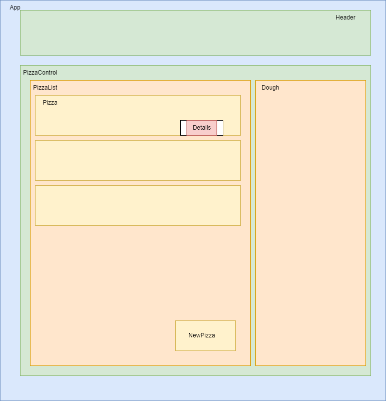

# Phoebe's Pizza

### Created by Noah Lundquist in November of 2022

## Links

* [Repository](https://github.com/nalundquist/phoebes-pizza)

## Description

A React-based website for a pizza shop.  Includes ability to make pizzas and throttles ability to do so based on a quantity of dough.  Ability to Create pizzas, Read details on said, and Update details on said pizzas (CRU).  

## Features

* Extensive conditional rendering based on current state
* CRU functionality for pizzas
* Parent components nest child compenents with shared state
* Measures taken to ensure minimal prop drilling

## Technologies Used

* Built in VS Code (v.1.70.1) using the following languages:
	* Javascript
	* React
	* CSS
	* JSX
	* HTML

Tested in Latest Google Chrome build

## Installation

* Download [Git Bash](https://git-scm.com/downloads)
* Input the following into Git Bash to clone this repository onto your computer:

		>git clone https://github.com/nalundquist/phoebes-pizza

* Enter the cloned project folder "phoebes-pizza" and type:

		>npm install

* After such you can type:

		>npm run start

* To host the site on your machine at localhost:3000.

## Known Bugs

* Edit does not currently modify the amount of dough used on the edited pizza
* Size and Toppings are stored as strings as I was attempting (unsuccessfully) to troubleshoot using select boxes in React.  If you type in "Small", "Medium", or "Large" verbatim the pizza will use 2, 3, and 4 units of dough respectively; putting in any other string will result in 5 units of dough being consumed.  Will read up on how to implement this for future projects as the current "solution" is not good, imho.

## License

Licensed under [GNU GPL 3.0](https://www.gnu.org/licenses/gpl-3.0.en.html)